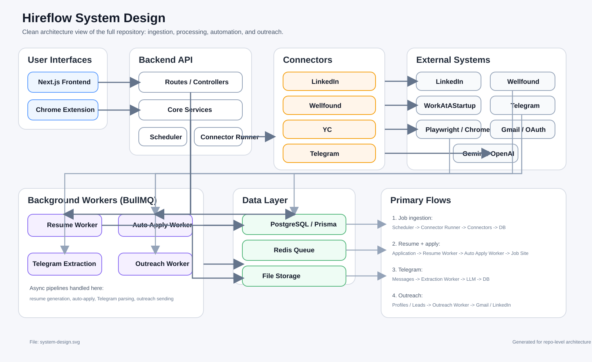

# Hireflow

### *The Intelligent AI-Powered Job Aggregator, Auto-Apply Engine & Cold Outreach Pipeline*

Hireflow is a distributed, enterprise-grade job search automation engine. It leverages browser automation, real-time message stream ingestion, and advanced LLM (OpenAI, Gemini, Azure) pipelines to aggregate jobs, tailor resumes without hallucination, automate the application submission process using stealth browsers, and run context-aware cold email/LinkedIn outreach campaigns.

Styled with a stark, premium developer-centric Vercel-inspired interface (designed in [DESIGN.md](file:///Users/shivamverma/Desktop/projects/Job-Scraper/frontend/DESIGN.md)), Hireflow is built for engineers and professionals looking to optimize, automate, and track every stage of their job application pipeline.

---

## System Architecture

Hireflow is divided into three distinct modules: a Next.js frontend, an Express.js backend powered by Prisma ORM and BullMQ background workers, and a Manifest V3 Chrome extension.



### Architecture Overview

1. **User Interfaces**
   * **Next.js Frontend** renders the jobs board, profile settings, outreach board, and Telegram dashboard.
   * **Chrome Extension** captures LinkedIn profiles and sends them to the backend outreach flow.

2. **Backend API**
   * **Express routes** expose auth, jobs, applications, Telegram, and outreach endpoints.
   * **Core services** handle ingestion, Gmail, Telegram, resume generation, resume optimization, and stealth browser setup.
   * **Scheduler** triggers recurring fetch cycles.
   * **Connector runner** executes the active job sources and consolidates normalized jobs.

3. **Job Aggregation Layer**
   * **LinkedIn connector** builds search URLs, opens pages with Playwright + saved session state, parses rendered listings, and normalizes them.
   * **Wellfound connector** builds role/location URLs, loads pages with Playwright, parses startup/job cards, and normalizes them.
   * **YC connector** requests WorkAtAStartup pages with saved cookies, parses listings, and normalizes them.
   * **Telegram connector** reads monitored channel messages, stores raw messages, and converts them to jobs through the extraction pipeline.

4. **Background Workers**
   * **Resume worker** fetches or reuses the job description, optimizes the resume with an LLM, and generates PDF/LaTeX/HTML artifacts.
   * **Auto-apply worker** launches Playwright, selects the correct platform adapter, uploads the tailored resume, fills forms, and updates application state.
   * **Telegram extraction worker** reads raw Telegram messages from the queue, sends them to Gemini for structured extraction, validates them, deduplicates them, and stores them as jobs.
   * **Outreach worker** generates and sends email or LinkedIn outreach flows.

5. **Data Layer**
   * **PostgreSQL + Prisma** stores jobs, applications, resume versions, outreach entities, profiles, users, and Telegram raw messages.
   * **Redis + BullMQ** powers asynchronous pipelines for resume generation, auto-apply, outreach, and Telegram extraction.
   * **Local storage** holds saved browser sessions, generated resumes, and failure screenshots.

6. **External Systems**
   * **LinkedIn / Wellfound / WorkAtAStartup** are scraped or automated by connectors/adapters.
   * **Telegram** is consumed through GramJS using the authenticated user session.
   * **Gemini / OpenAI / Azure OpenAI** are used for extraction, resume tailoring, and message generation.
   * **Gmail / Google OAuth** supports outreach sending and account authorization.
   * **Playwright / Chromium / Chrome** powers scraping, job description crawling, and application submission.

### Primary End-to-End Flows

1. **Job ingestion**
   * Scheduler -> Connector Runner -> Source Connectors -> Normalization -> Ingestion Service -> Jobs table

2. **Resume optimization**
   * Application queued -> Resume worker -> Job description fetch -> LLM optimization -> Resume artifact generation -> Resume version stored

3. **Auto apply**
   * Ready application -> Auto-apply worker -> Playwright browser -> LinkedIn/Wellfound adapter -> Form filling / resume upload -> Application and job status update

4. **Telegram extraction**
   * Telegram message -> Raw message table -> BullMQ queue -> Gemini extraction worker -> Validation / dedupe -> Jobs table

5. **Cold outreach**
   * Frontend/Extension input -> Lead/Profile records -> Outreach worker -> Draft generation -> Approval / send -> Gmail or LinkedIn delivery

For a detailed technical design breakdown of all pipelines, schemas, and evasion tactics, see [architecture.md](file:///Users/shivamverma/Desktop/projects/Job-Scraper/architecture.md).

---

## Core Features

### 1. Job Ingestion & Real-Time Monitoring
*   **Multi-Source Aggregations:** Aggregates jobs from Wellfound (AngelList), Y Combinator (YC) Jobs, LinkedIn, and Telegram.
*   **Real-time Telegram Monitoring:** [telegram.service.ts](file:///Users/shivamverma/Desktop/projects/Job-Scraper/backend/src/services/telegram.service.ts) logs into user account sessions, monitoring target channels or fetching historical post logs.
*   **LLM Extraction Worker:** Enqueues raw posts into BullMQ, using [telegram-extraction.worker.ts](file:///Users/shivamverma/Desktop/projects/Job-Scraper/backend/src/queues/telegram-extraction.worker.ts) to parse job details, location, salary, descriptions, and apply URLs dynamically using the Google Gemini API.
*   **Fingerprint Deduplication:** Enforces unique listings by running a SHA-256 fingerprint hash of `company|role|applyUrl` inside the database to prevent duplicate listings.

### 2. Fact-Grounded AI Resume Tailoring
*   **Job Description (JD) Crawler:** Uses headless Playwright to navigate to job apply URLs, bypass JS-hydration limits, and scrape descriptions using selector selectors.
*   **Anti-Hallucination Constraints:** Utilizes GPT-4o-mini, Azure OpenAI, or Gemini via [resume-optimizer.service.ts](file:///Users/shivamverma/Desktop/projects/Job-Scraper/backend/src/services/resume-optimizer.service.ts) to optimize resume experience sections, matching keywords to the target job description while strictly forbidding accomplishment fabrication.
*   **Dual-Engine PDF Generator:** [resume-generator.service.ts](file:///Users/shivamverma/Desktop/projects/Job-Scraper/backend/src/services/resume-generator.service.ts) formats resume JSON into LaTeX, compiling it via `pdflatex`. If local LaTeX binaries are missing, it falls back to compiled HTML/CSS styled with the premium Outfit Google Font, rendered directly to high-fidelity PDF via Playwright (`page.pdf`).

### 3. Human-Mimicking Auto-Apply
*   **Stealth Evasion:** Wraps Chromium with `puppeteer-extra-plugin-stealth` in [stealth-browser.ts](file:///Users/shivamverma/Desktop/projects/Job-Scraper/backend/src/services/stealth-browser.ts) and injects scripts to mask browser automation markers (Permissions API, WebGL signatures, `navigator.webdriver`, etc.).
*   **Interactive Human Simulation:** [human-like.ts](file:///Users/shivamverma/Desktop/projects/Job-Scraper/backend/src/services/human-like.ts) mimics human input with:
    *   *Natural Keyboard Emulation:* Randomizes keystrokes (60-220ms) and introduces mid-word typing pauses.
    *   *Bézier Mouse Curves:* Moves pointer dynamically along curvature paths with center-offset random coordinates.
    *   *Realistic Navigation:* Randomizes scroll behaviors and captures failure screenshots under `storage/screenshots/apply-failure-*`.
*   **Screening Question Solver:** Automatically fills LinkedIn Easy Apply forms via [linkedin-apply.adapter.ts](file:///Users/shivamverma/Desktop/projects/Job-Scraper/backend/src/connectors/adapters/linkedin-apply.adapter.ts) by parsing fields using regex matching:
    *   Dropdown selects (e.g., citizenship/visa questions select `Yes`/`No`, language selects `Professional`).
    *   Radio fieldsets and numeric inputs (defaulting values appropriately).

### 4. Automated Cold Outreach & Gmail OAuth
*   **Gmail Integration:** Features Google OAuth access loops, refreshing expired tokens automatically via [gmail.service.ts](file:///Users/shivamverma/Desktop/projects/Job-Scraper/backend/src/services/gmail.service.ts) to send threaded cold emails.
*   **CDP-Connected LinkedIn Outreach:** Bypasses cookie invalidation restrictions inside [linkedin-outreach.routes.ts](file:///Users/shivamverma/Desktop/projects/Job-Scraper/backend/src/routes/linkedin-outreach.routes.ts) by attaching Playwright directly to a running Chrome profile via Chrome DevTools Protocol (`connectOverCDP`).
*   **Smart Connection Notes:** Detects InMail paywalls on LinkedIn, falling back to connection requests and generating custom connection notes (strictly capped at 300 characters).
*   **Outbox Approval Flow:** Outreach campaigns generate draft recommendations that wait in the user approval outbox before dispatch.

---

## Repository Directory Layout

```
├── backend/                  # Node.js + Express.js TypeScript Backend API
│   ├── prisma/               # Prisma schema definitions & migrations
│   │   └── schema.prisma     # Core Postgres schema models (Jobs, Applications, Resumes, Leads)
│   ├── src/
│   │   ├── connectors/       # Platforms scrapers (LinkedIn, Wellfound, YC)
│   │   │   └── adapters/     # Web auto-apply adapters (LinkedIn, Wellfound)
│   │   ├── queues/           # BullMQ Workers (resume compilation, apply, outreach, extraction)
│   │   ├── routes/           # REST API routes (Auth, Outreach, Telegram, LinkedIn)
│   │   ├── scheduler/        # Fetch and cleanup interval cron-like schedulers
│   │   ├── scripts/          # Helper setup scripts (telegram login, connector tests)
│   │   ├── services/         # Core system utilities (stealth-browser, LLM connectors, Gmail API)
│   │   └── index.ts          # Main Express backend bootstrapper & health check server
│   └── package.json          # Backend build scripts & dependency definitions
│
├── frontend/                 # React + Next.js Web Dashboard (Vercel-inspired Stark Theme)
│   ├── src/
│   │   ├── app/              # Next.js App Router folders (/login, /outreach, /queue, /telegram, /tracker)
│   │   ├── components/       # Premium design UI elements (JobsBoard, OutreachBoard, etc.)
│   │   ├── lib/              # Frontend API helpers and utility files
│   │   ├── middleware.ts     # User authentication validation middleware
│   │   └── index.css         # Base styles & theme values configuration
│   └── package.json          # Frontend build scripts & dependency definitions
│
└── extension/                # Manifest V3 Chrome Extension (LinkedIn Saver Profile Collector)
    ├── manifest.json         # Extension permissions and background config
    ├── popup.html            # Extension popup HTML structure
    ├── popup.css             # Extension popup stylesheet
    └── popup.js              # Injects script to extract profiles and submit to API
```

---

## Configuration & Environment Setup

To run the backend, create a `.env` file in the `backend/` directory referencing the variables below:

| Environment Variable | Description | Example / Default |
|----------------------|-------------|-------------------|
| `DATABASE_URL` | Neon PostgreSQL connection URI | `postgresql://...` |
| `PORT` | Backend HTTP API Server Port | `3000` |
| `RUN_CRAWLER_ON_BOOT`| Triggers the job crawler schedulers immediately on start | `false` |
| `GEMINI_API_KEY` | Google Gemini API Key | `AIzaSy...` |
| `AZURE_OPENAI_API_KEY`| Azure OpenAI Endpoint API Key (Optional) | `...` |
| `AZURE_OPENAI_ENDPOINT`| Azure OpenAI Endpoint base URI (Optional) | `https://...openai.azure.com/` |
| `AZURE_OPENAI_DEPLOYMENT`| Azure OpenAI deployment name for model matching (Optional) | `gpt-4o-mini` |
| `MAX_DAILY_APPLICATIONS`| Cap on daily automated job application submissions | `15` |
| `MIN_APPLY_DELAY_MS` | Minimum random delay between applications (in ms) | `180000` (3 mins) |
| `MAX_APPLY_DELAY_MS` | Maximum random delay between applications (in ms) | `480000` (8 mins) |
| `HEADLESS_APPLY` | Runs the Playwright Apply browser headless | `false` (shows browser) |
| `USE_PERSISTENT_CHROME`| Enables Playwright to hook into actual user Chrome sessions | `true` |
| `TELEGRAM_API_ID` | Telegram API identifier for GramJS | `33591383` |
| `TELEGRAM_API_HASH` | Telegram API Hash for GramJS | `da7afd54a...` |
| `TELEGRAM_SESSION` | Authenticated GramJS connection session token | `...` |
| `GOOGLE_CLIENT_ID` | Google OAuth Client ID for Gmail API | `...apps.googleusercontent.com` |
| `GOOGLE_CLIENT_SECRET`| Google OAuth Client secret for Gmail API | `...` |
| `EMAIL_USER` | Gmail address for outbound messages | `yourname@gmail.com` |
| `EMAIL_PASS` | Gmail App Password | `abcd efgh ijkl mnop` |
| `OUTREACH_API_KEY` | Secret validation token for inbound Chrome Extension posts | `hireflow_sec_key_2026_x92a8b` |

---

## Getting Started

### 1. Database Setup
Navigate to the backend directory, install packages, and generate/migrate your PostgreSQL database:
```bash
cd backend
pnpm install
pnpm prisma:generate
npx prisma db push
```

### 2. Running the Backend
Start the Express server with live TypeScript reloading and BullMQ workers:
```bash
pnpm dev
```

### 3. Running the Frontend Dashboard
Navigate to the frontend folder, install dependencies, and start the Next.js development server:
```bash
cd ../frontend
npm install
npm run dev
```
Open [http://localhost:3001](http://localhost:3001) in your browser.

### 4. Setting Up the Chrome Extension
1. Open Google Chrome and visit `chrome://extensions`.
2. Toggle the **Developer mode** switch in the top right.
3. Click **Load unpacked** in the top left.
4. Select the `extension/` directory of this repository.
5. Open any LinkedIn profile (e.g., `https://www.linkedin.com/in/some-recruiter`), click the extension icon, configure the API URL (`http://localhost:3000`) and the API key (`hireflow_sec_key_2026_x92a8b`), and click **Save current profile**.

---

## Scripts & Utility Commands

The `backend` [package.json](file:///Users/shivamverma/Desktop/projects/Job-Scraper/backend/package.json) provides helper scripts to register sessions and test individual components:

*   **Telegram Session Registration:**
    ```bash
    pnpm telegram:login
    ```
    Runs interactive authentication inside your terminal to generate a valid `TELEGRAM_SESSION` key.
*   **Testing Connectors:**
    ```bash
    pnpm test:linkedin       # Tests LinkedIn scraper & search automation
    pnpm test:wellfound      # Tests Wellfound crawler connection
    pnpm test:yc             # Tests Y Combinator Jobs crawler
    ```
*   **Importing/Saving Sessions:**
    ```bash
    pnpm save-session:linkedin  # Launches headed Playwright to log in and save cookies
    pnpm save-session           # Launches headed Playwright to log in to Wellfound and save cookies
    ```

---

## License

This project is licensed under the ISC License. See the backend's [package.json](file:///Users/shivamverma/Desktop/projects/Job-Scraper/backend/package.json) file for details.
