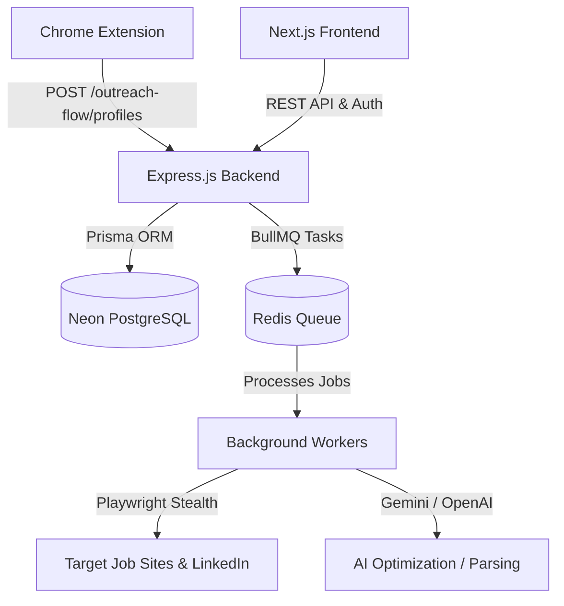

# Hireflow Project Architecture & Technical Design

This document provides an in-depth architectural and technical design breakdown of the **Hireflow** project. It outlines the technology stack, database schema, background worker pipelines, browser automation details, and outreach integration mechanisms.

---

## 1. Technological Stack

Hireflow is designed as a distributed application with three distinct components:



*   **Backend**: Node.js (TypeScript) running an Express server. Utilizes Prisma ORM for database connections and BullMQ for managing Redis-backed job queues.
*   **Frontend**: React / Next.js app styled with a modern, stark Vercel-inspired theme (defined in [DESIGN.md](file:///Users/shivamverma/Desktop/personal-work/Job-Scraper/frontend/DESIGN.md)) and leveraging custom components.
*   **Browser Extension**: Chrome Manifest V3 extension implementing targeted content script injection to extract active profiles on LinkedIn.
*   **Integrations**:
    *   *OpenAI API / Gemini API*: For resume tailoring, extraction, and generation.
    *   *Playwright & Playwright-Extra*: For human-mimicking web page automation (job scraping, auto-apply, and LinkedIn cold outreach).
    *   *GramJS (Telegram)*: For real-time monitoring and historical scraping of Telegram job channels.
    *   *Google OAuth & Gmail API*: For threaded outreach emails and conversation tracking.

---

## 2. Database Schema & Data Models

The data layer is defined in [schema.prisma](file:///Users/shivamverma/Desktop/personal-work/Job-Scraper/backend/prisma/schema.prisma) and deployed on Neon PostgreSQL:

### Core Entities & Relations

1.  **Job Aggregate**:
    *   `Job`: Stores aggregated postings. Source platforms include wellfound, yc, linkedin, telegram, and manual. Unique listings are enforced using a SHA-256 fingerprint hash of `company|role|applyUrl`.
    *   `TelegramMessage` & `TelegramChannel`: Monitor source messages and channels before extraction.
2.  **Application Pipeline**:
    *   `Application`: Tracks job application state machines (`QUEUED`, `GENERATING_RESUME`, `READY_TO_APPLY`, `APPLYING`, `APPLIED`, `FAILED`).
    *   `ResumeVersion`: Links a compiled LaTeX and PDF resume tailored to a specific job application.
    *   `Resume`: Stores the parsed raw text and extracted skill tokens of a user's master resume.
3.  **Outreach System**:
    *   `Lead` & `Message`: Handle email campaigns. A `Lead` is associated with a company, email, and target JD. `Message` stores the email sequence (initial and threaded follow-ups).
    *   `Profile`: Contact profiles scraped via the browser extension.
    *   `GenerationJob`: Tracks the state of LLM outbox generation.
    *   `OutboundMessage`: Outbox records tracking drafts, approvals, and dispatch status (sent, replied, failed) on LinkedIn or Email.
    *   `ConversationTracker`: Performs analytics and sentiment tracking on replies.
4.  **Configuration**:
    *   `GoogleToken`: Singleton instance containing Google OAuth credentials for Gmail API access.
    *   `User` & `AuthMethod`: User management supporting third-party identity providers (Google, GitHub) or traditional email/password credentials.

---

## 3. Core Engine Pipelines

### A. Job Aggregation & Telegram Ingestion
Jobs are scraped from standard job boards using dedicated connectors or ingested from Telegram in real-time:

1.  **GramJS Ingestion**: [telegram.service.ts](file:///Users/shivamverma/Desktop/personal-work/Job-Scraper/backend/src/services/telegram.service.ts) logs into a user account session and monitors target channel message streams or fetches historical logs.
2.  **BullMQ Extraction Worker**: Raw text messages are enqueued to [telegram-extraction.worker.ts](file:///Users/shivamverma/Desktop/personal-work/Job-Scraper/backend/src/queues/telegram-extraction.worker.ts). The worker sends the payload to Google's Gemini API to extract structured variables:
    ```json
    {
      "company": "Company Name",
      "role": "Software Engineer",
      "apply_url": "https://example.com/apply",
      "location": "Remote",
      "salary": "$120,000",
      "job_description": "..."
    }
    ```
3.  **Deduplication**: The database creates a SHA-256 fingerprint from the company, role, and URL. If duplicate records exist, the incoming message is skipped; otherwise, it is saved under the source `telegram`.

### B. AI Resume Optimization & Tailoring
When an application is queued, [resume.worker.ts](file:///Users/shivamverma/Desktop/personal-work/Job-Scraper/backend/src/queues/resume.worker.ts) executes the following sequence:

1.  **JD Crawling**: If the job posting lacks a description, a headless Playwright instance is dispatched to the apply URL. It waits for JavaScript hydration and queries structural selectors (e.g. `#job-details`, `.jobs-description__content`) to download the full job description.
2.  **Fact-Grounded Optimization**: [resume-optimizer.service.ts](file:///Users/shivamverma/Desktop/personal-work/Job-Scraper/backend/src/services/resume-optimizer.service.ts) sends the master resume text alongside the target job description to OpenAI (`gpt-4o-mini`), Azure OpenAI, or Gemini. The prompt strictly constrains the LLM against hallucinating accomplishments or credentials while rewriting summary details, skills, and experience items.
3.  **LaTeX/HTML Compilation**: [resume-generator.service.ts](file:///Users/shivamverma/Desktop/personal-work/Job-Scraper/backend/src/services/resume-generator.service.ts) formats the output JSON into a standard LaTeX file. It tries compiling this via `pdflatex` twice. If `pdflatex` is missing on the host machine, it falls back to generating a responsive HTML document utilizing the Outfit Google Font and prints it to a high-fidelity PDF via Playwright (`page.pdf`).
4.  **State Handshake**: Enqueues the task to the `auto-apply` queue.

### C. Automated Application Flow
The application worker ([apply.worker.ts](file:///Users/shivamverma/Desktop/personal-work/Job-Scraper/backend/src/queues/apply.worker.ts)) enforces a daily cap (default 15/day) and random delays (3 to 8 minutes) to protect accounts. It features the following subsystems:

#### 1. Stealth Evasion & Human Mimicry
*   [stealth-browser.ts](file:///Users/shivamverma/Desktop/personal-work/Job-Scraper/backend/src/services/stealth-browser.ts) wraps Chromium with `puppeteer-extra-plugin-stealth` and injects initial configuration scripts overriding fingerprint vectors (e.g., `navigator.webdriver`, `window.chrome`, Permissions API, WebGL GPU rendering signatures).
*   [human-like.ts](file:///Users/shivamverma/Desktop/personal-work/Job-Scraper/backend/src/services/human-like.ts) implements interaction utilities:
    *   `humanType()`: Emulates realistic typing speed (60–220ms keystrokes) and pauses mid-word.
    *   `humanClick()`: Moves the mouse along dynamic Bézier-like curve steps and clicks with a randomized coordinate offset from the element center.
    *   `humanScroll()`: Scrolls in dynamic steps with variable pauses.
    *   `detectBlock()`: Sniffs redirects to identify authentication walls or challenges, taking screenshots (`storage/screenshots/apply-failure-*`) on failures.

#### 2. Screening Question Solver
The [linkedin-apply.adapter.ts](file:///Users/shivamverma/Desktop/personal-work/Job-Scraper/backend/src/connectors/adapters/linkedin-apply.adapter.ts) adapter drives the page logic inside the LinkedIn Easy Apply modal:
*   **Text Field Parsing**: Inspects text fields, matching label tags against regex queries:
    *   `phone|mobile` -> Types a mock contact number.
    *   `experience|years` -> Inputs `2` years.
    *   `salary|compensation` -> Inputs `Open / Negotiable`.
    *   *Numeric fields* -> Defaults to `2`.
    *   *General fallbacks* -> Defaults to `Yes`.
*   **Select Dropdowns**: Inspects `<select>` elements and chooses best-match text values:
    *   `authorized|citizen|work in` -> Selects `Yes`.
    *   `sponsorship|require visa` -> Selects `No`.
    *   `proficiency|english` -> Selects `Professional`.
*   **Radio Option Groups**: Inspects `<fieldset>` options and checks the correct label matching sponsorship, visa, or citizenship rules.

---

## 4. Cold Outreach & Integrations

### A. Gmail Outreach API
*   Provides OAuth routes ([outreach.routes.ts](file:///Users/shivamverma/Desktop/personal-work/Job-Scraper/backend/src/routes/outreach.routes.ts)) to link a Google account.
*   Pulls from `GoogleToken` to automatically refresh credentials on expiration.
*   [gmail.service.ts](file:///Users/shivamverma/Desktop/personal-work/Job-Scraper/backend/src/services/gmail.service.ts) compiles MIME messages and inserts `In-Reply-To` and `References` headers for threaded follow-ups.
*   Sends approved messages with a randomized 1–3 minute spacing delay.

### B. LinkedIn Direct Outreach API
Automates LinkedIn connection note outreach ([linkedin-outreach.routes.ts](file:///Users/shivamverma/Desktop/personal-work/Job-Scraper/backend/src/routes/linkedin-outreach.routes.ts)):
*   **CDP Connection Mode**: Bypasses cookie transfers by connecting directly to an active Google Chrome application running with remote debugging port 9222 enabled (`chromium.connectOverCDP`).
*   **Playwright Headed Mode**: Spawns a dedicated headed Chromium instance using stored session cookies (`linkedin-session.json`).
*   **Action Flow**: Visits the profile, scans the page for the "Message" button, and focuses the chat box. If it gets blocked by a Premium InMail paywall, it closes the modal and clicks the "Connect" button instead, sending the message as a **Connection Request note** (strictly capped at 300 characters by Gemini).
*   Enforces a 45–75 second delay between recruiters.

---

## 5. Frontend & Extension Subsystems

*   **Next.js Frontend**:
    *   `JobsBoard` ([jobs-board.tsx](file:///Users/shivamverma/Desktop/personal-work/Job-Scraper/frontend/src/components/jobs-board.tsx)): Main interface. Renders job cards, lists, details, and lets users queue applications or trigger crawls.
    *   `OutreachBoard` ([outreach-board.tsx](file:///Users/shivamverma/Desktop/personal-work/Job-Scraper/frontend/src/components/outreach-board.tsx)): Core dashboard for managing resumes, cold outreach lists, message templates, analytics, drafts editing, and approval outbox.
    *   `TelegramDashboard` ([telegram-dashboard.tsx](file:///Users/shivamverma/Desktop/personal-work/Job-Scraper/frontend/src/components/telegram-dashboard.tsx)): Tracks processed messages and lets users register monitored channels.
*   **Chrome Extension (`extension/`)**:
    *   Runs inside active tabs (`linkedin.com/in/`).
    *   [popup.js](file:///Users/shivamverma/Desktop/personal-work/Job-Scraper/extension/popup.js) runs content script injection to extract names, current headlines, company affiliations, location descriptors, pronouns, and "About" bios. It submits the parsed record to `POST /outreach-flow/profiles` using the user's configuration parameters.
